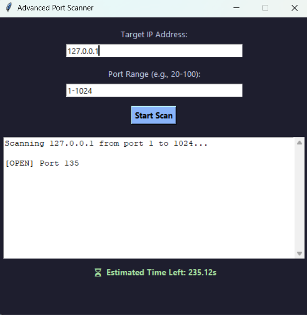

# 🔐 Advanced Port Scanner (GUI-based)

A Python-based Port Scanner with a clean Tkinter GUI interface that allows users to scan a range of ports on any IP address — with **live Estimated Time Left** display. This project is beginner-friendly yet powerful, useful for basic cybersecurity audits and networking education.

---

## 📸 Demo

---

## 🚀 Features

- ✅ GUI built with **Tkinter**
- 🛜 Enter any target IP (e.g., `127.0.0.1`, `scanme.nmap.org`)
- 🔢 Scan any custom **port range**
- 🟢 Live result display with open ports
- ⏳ **Estimated Time Left** updates live while scanning
- ⚠️ Graceful error handling (invalid IPs, port input)
- 🧠 Clean, dark-themed interface

---

## 🧰 Technologies Used

- Python 3.x
- Tkinter (built-in GUI library)
- `socket` for TCP connections
- Threading to prevent GUI freeze

---

## 📦 Project Structure

